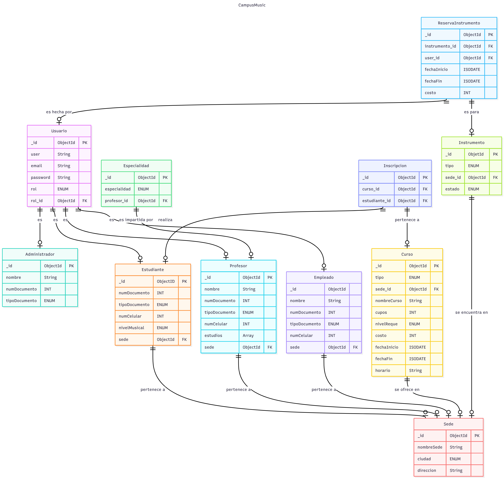

<h1 align=center>Base de Datos (DB) CAMPUS MUSIC</h1>
 
 <h6 align=center>Proyecto MongoDB: (Alan Thomas Ramírez Vargas & Sharick Giovanna Pinto Rodriguez)</h6>

# Tabla de Contenido
<h6 align=center> 1. Introducción </h6>

<h6 align=center> 2. Caso de Estudio </h6>

<h6 align=center> 3. Requerimientos </h6>

<h6 align=center> 4. Modelo Conceptual  </h6>

<h6 align=center> 5. Modelo Lógico  </h6>

<h6 align=center> 6. Normalización </h6>

# Introducción

Campus Music, organización que administra múltiples escuelas de música en distintas ciudades, emprende la migración de su operación desde hojas de cálculo hacia una base de datos robusta en MongoDB. El propósito es unificar la gestión de estudiantes, profesores, empleados, cursos, sedes e inscripciones en un repositorio único que elimine la duplicación de información, reduzca errores y permita controlar transacciones de matrícula (validación de cupos, registro de costos y fechas), así como habilitar consultas analíticas y la administración de reservas de instrumentos. Con esta implementación se fortalecerán la integridad y consistencia de los datos, la seguridad basada en roles y la disponibilidad de reportes confiables sobre ocupación, demanda e ingresos.

A continuación se documenta minuciosamente el proceso que se siguió para ejecutar la elaboración de la base de datos solicitada para el sistema enfocado a la escuela de musica (CAMPUS MUSIC), implementando modelo conceptual, lógico y finalmente físico (proceso de normalización hasta la 3ra Forma Normal que se debe llevar a cabo entre estas últimas dos fases).

Describiendo el flujo de trabajo lógico que se desarrolló, así como diagramas que muestran detalladamente los avances realizados en cada etapa del desarrollo de la BBDD, las entidades que derivaron de los requerimientos solicitados por el cliente y las relaciones entre estas definiendo las cardanilidades.

Finalmente, se realizan inserciones de datos dentro del sistema, se crean usuarios con diferentes permisos de acceso a la base de datos; ejecutando pruebas, como última medida, a través de consultas y funciones dentro de la BBDD que permitan a quienes tengan acceso a ella el poder manipular la forma en la que la información se presenta, pudiendo realizar diferentes tipos de filtrado de datos, entre otros tipos de consultas.

# 2. Caso de Estudio

En el presente caso de estudio, Campus Music enfrenta problemas organizacionales asociados a la falta de un sistema de base de datos eficiente y centralizado. Esta carencia se traduce en duplicidad de registros, errores de consistencia y limitaciones para organizar, analizar y utilizar la información de manera oportuna, afectando la gestión académica, operativa y la toma de decisiones.

Problema: datos dispersos y sin control de cupos; reportes manuales poco confiables.

Solución: centralizar en MongoDB con reglas de negocio, transacciones y agregaciones.

Alcance: sedes, profesores, estudiantes, cursos, inscripciones, reservas, usuarios/roles.

# 3. Requerimientos

CRUD de estudiantes, profesores, cursos, sedes, usuarios (roles).

Inscribir estudiantes con validación de cupos, registro de costo y fecha; decrementar cupo en transacción.

Reservar instrumentos físicos por sede.

Reportes: ocupación por sede (último mes), cursos más demandados, ingreso por sede, profesor con más estudiantes, instrumento más reservado, historial por estudiante, cursos en ejecución, exceso de cupo.  

# 4. Modelo Conceptual

Descripción   
Un modelo conceptual en bases de datos es una representación, que describe las entidades, atributos y relaciones entre ellas en un negocio determinado, sin entrar en detalles de implementación tecnológica más específica. Su objetivo es comunicar la estructura de datos de manera clara y comprensible para los stakeholders, incluso aquellos sin conocimientos técnicos, y servir como base para el diseño lógico y físico de la base de datos.  

# 5. Modelo Lógico 
Descripción    
Un modelo lógico de base de datos es una representación más detallada y estructurada del modelo conceptual, en la que se definen de manera precisa las entidades, sus atributos, y las relaciones entre ellas, así como aspectos técnicos como los identificadores únicos (llaves primarias), llaves foráneas y restricciones de integridad. A diferencia del modelo conceptual, el modelo lógico ya toma en cuenta cómo los datos serán organizados y estructurados dentro de un sistema de gestión de bases de datos.

## CODIGO DE DIAGRAMA LOGICO
	
    erDiagram
	direction TB
	Usuario {
		_id ObjectId PK ""  
		user String  ""  
		email String  ""  
		password String  ""  
		rol ENUM  ""  
		rol_id ObjectId FK ""  
	}
	Administrador {
		_id ObjectId PK ""  
		nombre String  ""  
		numDocumento INT  ""  
		tipoDocumento ENUM  ""  
	}
	Estudiante {
		_id ObjectID PK ""  
		numDocumento INT  ""  
		tipoDocumento ENUM  ""  
		numCelular INT  ""  
		nivelMusical ENUM  ""  
		sede ObjectId FK ""  
	}
	Profesor {
		_id ObjectId PK ""  
		nombre String  ""  
		numDocumento INT  ""  
		tipoDocumento ENUM  ""  
		numCelular INT  ""  
		estudios Array  ""  
		sede ObjectId FK ""  
	}
	Especialidad {
		_id ObjectId PK ""  
		especialidad ENUM  ""  
		profesor_id ObjectId FK ""  
	}
	Empleado {
		_id ObjectId  ""  
		nombre String  ""  
		numDocumento INT  ""  
		tipoDocumento ENUM  ""  
		numCelular INT  ""  
		sede ObjectId FK ""  
	}
	Sede {
		_id ObjectId PK ""  
		nombreSede String  ""  
		ciudad ENUM  ""  
		direccion String  ""  
	}
	Curso {
		_id ObjectId PK ""  
		tipo ENUM  ""  
		sede_id ObjectId FK ""  
		nombreCurso String  ""  
		cupos INT  ""  
		nivelReque ENUM  ""  
		costo INT  ""  
		fechaInicio ISODATE  ""  
		fechaFin ISODATE  ""  
		horario String  ""  
	}
	Inscripcion {
		_id ObjectId PK ""  
		curso_id ObjectId FK ""  
		estudiante_id ObjectId FK ""  
	}
	Instrumento {
		_id ObjetId PK ""  
		tipo ENUM  ""  
		sede_id ObjectId FK ""  
		estado ENUM  ""  
	}
	ReservaInstrumento {
		_id ObjectId PK ""  
		instrumento_id ObjectId FK ""  
		user_id ObjectId FK ""  
		fechaInicio ISODATE  ""  
		fechaFin ISODATE  ""  
		costo INT  ""  
	}

	Usuario||--o|Administrador:"es"
	Usuario||--o|Estudiante:"es"
	Usuario||--o|Profesor:"es"
	Usuario||--o|Empleado:"es"
	Estudiante||--o|Sede:"pertenece a"
	Profesor||--o|Sede:"pertenece a"
	Empleado||--o|Sede:"pertenece a"
	Curso||--o|Sede:"se ofrece en"
	Inscripcion||--o|Estudiante:"realiza"
	Inscripcion||--o|Curso:"pertenece a"
	Especialidad||--o|Profesor:"es impartida por"
	ReservaInstrumento||--o|Usuario:"es hecha por"
	ReservaInstrumento||--o|Instrumento:"es para"
	Instrumento||--o|Sede:"se encuentra en"

     

## Justificación del uso de MongoDB

## Diseño del modelo de datos:
## Colecciones creadas
## Decisiones de uso de referencias o embebidos
## Validaciones $jsonSchema
## Explicación de validaciones por colección
## Índices
## Lista de índices creados
## Justificación técnica de su uso
## Estructura de los datos de prueba
## Explicación de cada agregación
## Transacción MongoDB
## Escenario utilizado
## Código explicado paso a paso
## Roles
## Descripción de cada rol
## Ejemplo de creación de usuarios con esos roles
## Conclusiones y mejoras posibles