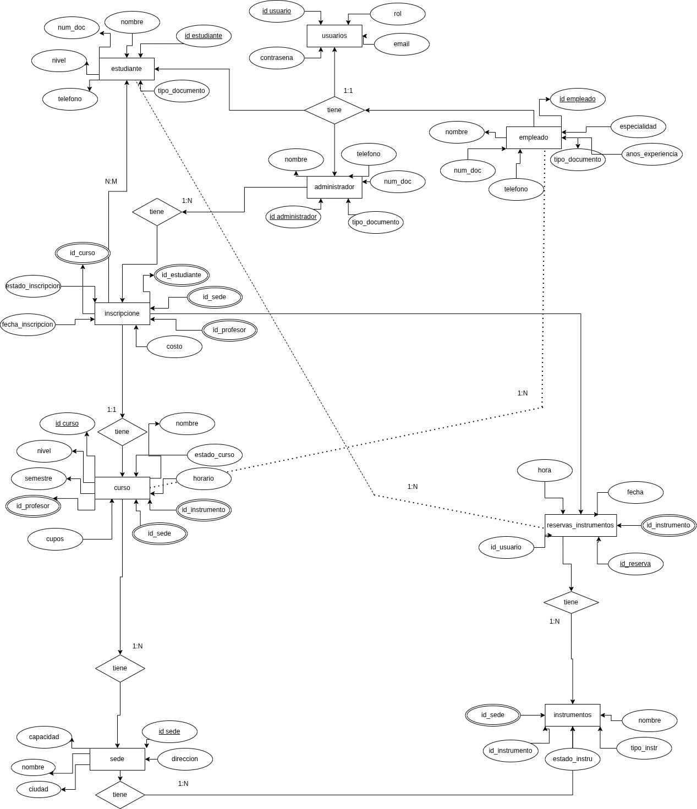
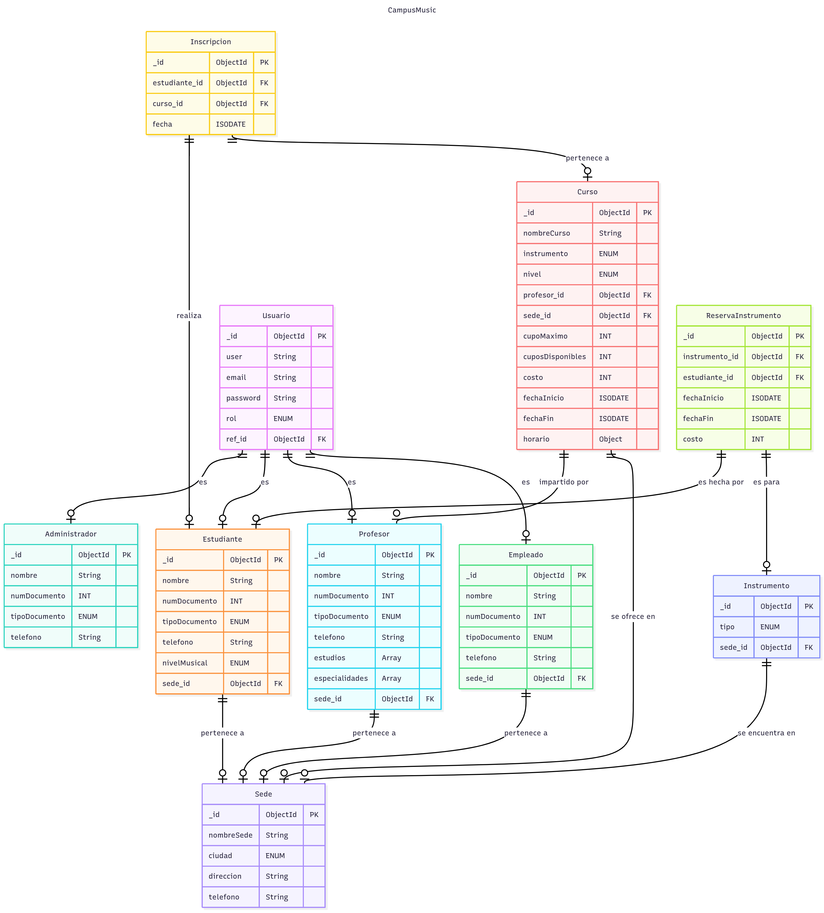

<h1 align=center>Base de Datos (DB) CAMPUS MUSIC</h1>
 

 <h6 align=center>Proyecto MongoDB: (Alan Thomas Ramírez Vargas & Sharick Giovanna Pinto Rodriguez)</h6>

---

# Tabla de Contenido
<h6 align=center> 1. Introducción </h6>

<h6 align=center> 2. Caso de Estudio </h6>

<h6 align=center> 3. Requerimientos </h6>

<h6 align=center> 4. Modelo Conceptual  </h6>

<h6 align=center> 5. Modelo Lógico  </h6>

<h6 align=center> 6. Normalización </h6>

---

# Introducción

Campus Music, organización que administra múltiples escuelas de música en distintas ciudades, emprende la migración de su operación desde hojas de cálculo hacia una base de datos robusta en MongoDB. El propósito es unificar la gestión de estudiantes, profesores, empleados, cursos, sedes e inscripciones en un repositorio único que elimine la duplicación de información, reduzca errores y permita controlar transacciones de matrícula (validación de cupos, registro de costos y fechas), así como habilitar consultas analíticas y la administración de reservas de instrumentos. Con esta implementación se fortalecerán la integridad y consistencia de los datos, la seguridad basada en roles y la disponibilidad de reportes confiables sobre ocupación, demanda e ingresos.

A continuación se documenta minuciosamente el proceso que se siguió para ejecutar la elaboración de la base de datos solicitada para el sistema enfocado a la escuela de musica (CAMPUS MUSIC), implementando modelo conceptual, lógico y finalmente físico (proceso de normalización hasta la 3ra Forma Normal que se debe llevar a cabo entre estas últimas dos fases).

Describiendo el flujo de trabajo lógico que se desarrolló, así como diagramas que muestran detalladamente los avances realizados en cada etapa del desarrollo de la BBDD, las entidades que derivaron de los requerimientos solicitados por el cliente y las relaciones entre estas definiendo las cardanilidades.

Finalmente, se realizan inserciones de datos dentro del sistema, se crean usuarios con diferentes permisos de acceso a la base de datos; ejecutando pruebas, como última medida, a través de consultas y funciones dentro de la BBDD que permitan a quienes tengan acceso a ella el poder manipular la forma en la que la información se presenta, pudiendo realizar diferentes tipos de filtrado de datos, entre otros tipos de consultas.

---

# 2. Caso de Estudio

En el presente caso de estudio, Campus Music enfrenta problemas organizacionales asociados a la falta de un sistema de base de datos eficiente y centralizado. Esta carencia se traduce en duplicidad de registros, errores de consistencia y limitaciones para organizar, analizar y utilizar la información de manera oportuna, afectando la gestión académica, operativa y la toma de decisiones.

La escuela requiere una base de datos robusta y centralizada para gestionar información de usuarios, inscripciones, sedes, instrumentos y administradores responsables de la operación. Además del simple almacenamiento, el cliente exigió una arquitectura de datos específica que garantizara claridad estructural, eliminación de duplicidades, consistencia en los registros, seguridad por roles y soporte para consultas y reportes; todo ello como fundamento para el posterior diseño lógico y físico de la base de datos.

Por un lado, se requería que los usuarios de Campus Music se clasificaran en tres roles: Administrador, Empleado de sede y Estudiante. Un Administrador puede gestionar una o varias sedes, mientras que cada sede debe estar asignada a un único Administrador. Los Empleados de sede tienen acceso limitado a la información de su sede —incluida la posibilidad de registrar inscripciones y reservas—, y los Estudiantes acceden a su propia información, consultan cursos disponibles y realizan inscripciones. La gestión del personal académico (profesores) se modela como entidad del dominio independiente de los roles de acceso.

Algunas de las entidades derivadas de los requerimientos ya contaban con una estructura inicial definida por el cliente, o al menos con un esquema base sobre el cual realizar ajustes para facilitar el mantenimiento y mejorar la organización de la base de datos.

En particular, sedes, estudiantes, profesores, cursos, inscripciones, instrumentos, reservas de instrumentos y usuarios/roles disponían de atributos fijos establecidos por el cliente. No obstante, dichos atributos podrían normalizarse posteriormente, separándolos en colecciones diferenciadas cuando resulte conveniente para la integridad y el rendimiento.

Se especifican también relaciones entre directores generales y hospitales, así como relaciones entre pacientes y visitas médicas (un mismo paciente puede solicitar múltiples visitas, pero cada visita está asociada a un único paciente). Las demás relaciones se tendrán que deducir por lógica y siguiendo la estructura y contexto en el que se desarrolla la base de datos.

Dado que el sistema está enfocado en varios Municipios, los datos ingresados, la cantidad de estos y los formatos que se definirán a través de `$jsonSchema` serán coherentes con dicho contexto, estableciendo una conexión con la realidad que representa la BBDD.

Problema: datos dispersos y sin control de cupos; reportes manuales poco confiables.

Solución: centralizar en MongoDB con reglas de negocio, transacciones y agregaciones.

Alcance: sedes, profesores, estudiantes, cursos, inscripciones, reservas, usuarios/roles.

---
# 3. Descripción del proyecto

Este proyecto tiene como objetivo el diseño metodológico de un sistema de base de datos para Campus Music, institución dedicada a la enseñanza musical. La propuesta abarca la definición del modelo conceptual, lógico y físico, así como las validaciones e índices necesarios para garantizar un almacenamiento de datos eficiente, coherente y seguro.

A partir de este modelo, se busca facilitar la gestión integral de la información académica y operativa —sedes, profesores, estudiantes, cursos, inscripciones, instrumentos y reservasInstrumentos, permitiendo una organización sistemática y consultas ágiles por parte del cliente. De este modo, el sistema se concibe como una solución escalable y funcional frente al crecimiento de los datos y a las necesidades de análisis y control propias de una escuela de música.

---
# 4. Requerimientos

CRUD de estudiantes, profesores, cursos, sedes, usuarios (roles).

Inscribir estudiantes con validación de cupos, registro de costo y fecha; decrementar cupo en transacción.

Reservar instrumentos físicos por sede.

Reportes: ocupación por sede (último mes), cursos más demandados, ingreso por sede, profesor con más estudiantes, instrumento más reservado, historial por estudiante, cursos en ejecución, exceso de cupo.  

---

<h1 align=center>Planificación</h1>

<h3 align=left>5. Construcción del Modelo Conceptual</h3>

Un modelo conceptual en bases de datos es una representación, que describe las entidades, atributos y relaciones entre ellas en un negocio determinado, sin entrar en detalles de implementación tecnológica más específica. Su objetivo es comunicar la estructura de datos de manera clara y comprensible para los stakeholders, incluso aquellos sin conocimientos técnicos, y servir como base para el diseño lógico y físico de la base de datos.  

<h4 align=left>5.1 Modelo Conceptual</h4>

<h4 align=left>5.2 Descripcion Tecnica</h4>

A grandes rasgos, en esta primera fase se delimitaron las entidades nucleares del dominio (lista no exhaustiva, pues tras la normalización se añadieron entidades y atributos de apoyo). Las entidades principales consideradas fueron: sedes, cursos, profesores, estudiantes, inscripciones, instrumentos, reservas de instrumentos, usuarios y administradores.

Los atributos definidos en esta etapa se establecieron a un nivel introductorio, dado que aún no se contaba con el detalle completo para cada entidad; se priorizó lo estrictamente requerido por los objetivos del sistema y el caso de uso inicial. Posteriormente, durante la normalización y el diseño lógico/físico, dichos atributos y relaciones se refinaron para mejorar la integridad, reducir duplicidades y facilitar consultas, manteniendo coherencia con los requerimientos funcionales y no funcionales del proyecto.

---

<h3 align=left>6. Construcción del Modelo Lógico </h3>

Una vez finalizado el modelo conceptual, se empezo a desarrollar el proceso de establecimiento de un modelo lógico mejor estructurado en tablas (entidades) con columnas (atributos) y el tipo de dato para cada una de estas (string, int, decimal, etc.), así como determinadas características para determinadas columnas (primary key [PK] / foreign key [FK]).

<h4 align=left>6.1 Modelo Lógico</h4>

## CODIGO DE DIAGRAMA LOGICO
	

<h4 align=left>5.2 Descripcion Tecnica</h4>

Para el diseño lógico, ciertos datos se modelarán como cadenas (string), incluso cuando contengan dígitos, ya que no se realizarán operaciones aritméticas sobre ellos y pueden requerir validaciones con expresiones regulares: por ejemplo, números de teléfono, números/documentos de identificación o códigos alfanuméricos (p. ej., códigos de curso o seriales de instrumentos).

Los valores monetarios (p. ej., costos de inscripción o precios base de curso) se representarán como decimales; si se prevé operar en múltiples divisas, se añadirá un campo moneda para mantener la unidad de medida.

---

     

## Justificación del uso de MongoDB

## Diseño del modelo de datos:
## Colecciones creadas
## Decisiones de uso de referencias o embebidos
## Validaciones $jsonSchema
## Explicación de validaciones por colección
## Índices
## Lista de índices creados
## Justificación técnica de su uso
## Estructura de los datos de prueba
## Explicación de cada agregación
## Transacción MongoDB
## Escenario utilizado
## Código explicado paso a paso
## Roles
## Descripción de cada rol
## Ejemplo de creación de usuarios con esos roles
## Conclusiones y mejoras posibles