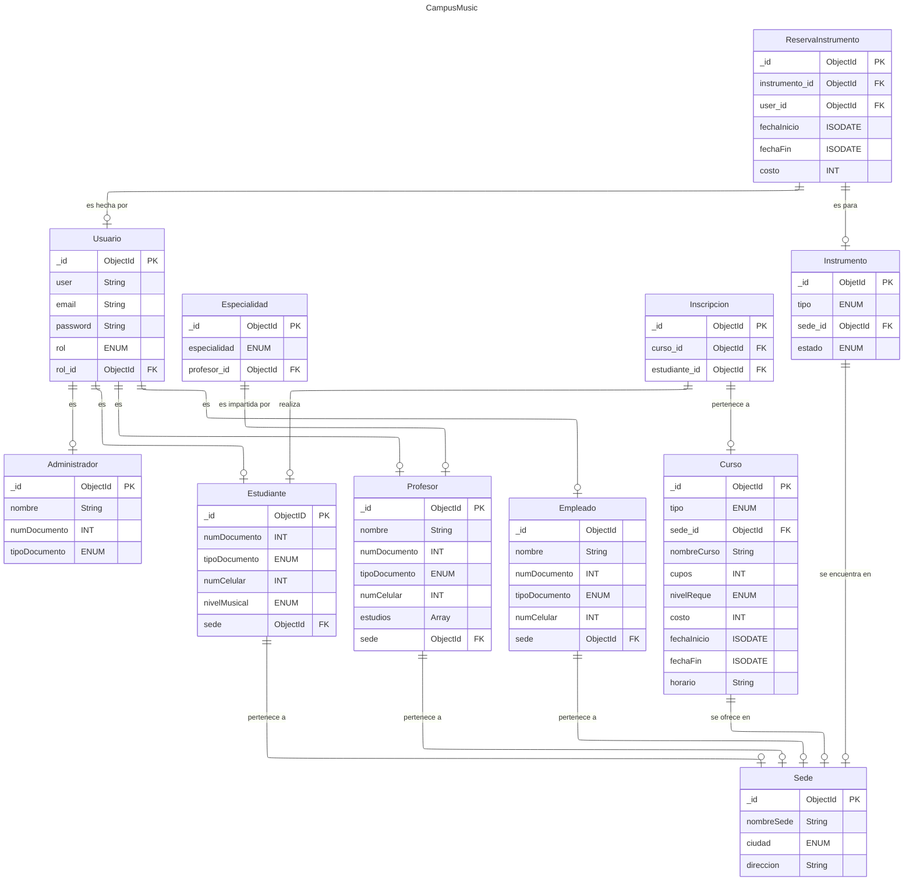
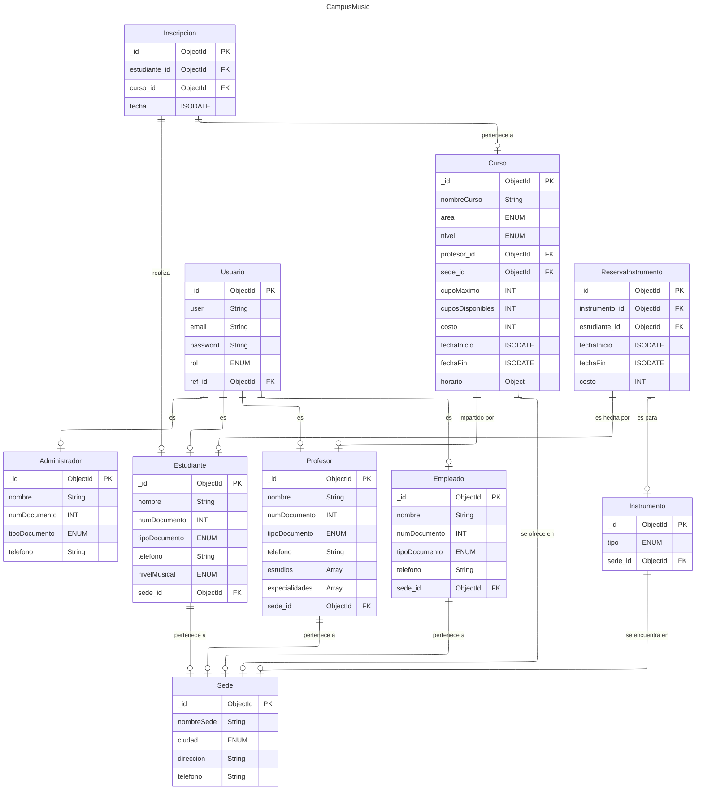

<h1 align=center>Base de Datos (DB) CAMPUS MUSIC</h1>
 

 <h6 align=center>Proyecto MongoDB: (Alan Thomas Ramírez Vargas & Sharick Giovanna Pinto Rodriguez)</h6>

 <div align="center">


</div>

---

# Tabla de Contenido
<h6 align=center> 1. Introducción </h6>

<h6 align=center> 2. Caso de Estudio </h6>

<h6 align=center> 3. Descripcion del proyecto </h6>

<h6 align=center> 4. Requerimientos </h6>

<h6 align=center> 5. Modelo Conceptual  </h6>

<h6 align=center> 6. Modelo Lógico  </h6>

<h6 align=center> 7. Normalización </h6>

<h6 align=center> 8. Estructura de la Base de Datos </h6>

<h6 align=center> 9. Modelo Fisico </h6>

<h6 align=center> 10. Inserciones de Datos </h6>


---

# Introducción

Campus Music, organización que administra múltiples escuelas de música en distintas ciudades, emprende la migración de su operación desde hojas de cálculo hacia una base de datos robusta en MongoDB. El propósito es unificar la gestión de estudiantes, profesores, empleados, cursos, sedes e inscripciones en un repositorio único que elimine la duplicación de información, reduzca errores y permita controlar transacciones de matrícula (validación de cupos, registro de costos y fechas), así como habilitar consultas analíticas y la administración de reservas de instrumentos. Con esta implementación se fortalecerán la integridad y consistencia de los datos, la seguridad basada en roles y la disponibilidad de reportes confiables sobre ocupación, demanda e ingresos.

A continuación se documenta minuciosamente el proceso que se siguió para ejecutar la elaboración de la base de datos solicitada para el sistema enfocado a la escuela de musica (CAMPUS MUSIC), implementando modelo conceptual, lógico y finalmente físico (proceso de normalización hasta la 3ra Forma Normal que se debe llevar a cabo entre estas últimas dos fases).

Describiendo el flujo de trabajo lógico que se desarrolló, así como diagramas que muestran detalladamente los avances realizados en cada etapa del desarrollo de la BBDD, las entidades que derivaron de los requerimientos solicitados por el cliente y las relaciones entre estas definiendo las cardanilidades.

Finalmente, se realizan inserciones de datos dentro del sistema, se crean usuarios con diferentes permisos de acceso a la base de datos; ejecutando pruebas, como última medida, a través de consultas y funciones dentro de la BBDD que permitan a quienes tengan acceso a ella el poder manipular la forma en la que la información se presenta, pudiendo realizar diferentes tipos de filtrado de datos, entre otros tipos de consultas.

---

# 2. Caso de Estudio

En el presente caso de estudio, Campus Music enfrenta problemas organizacionales asociados a la falta de un sistema de base de datos eficiente y centralizado. Esta carencia se traduce en duplicidad de registros, errores de consistencia y limitaciones para organizar, analizar y utilizar la información de manera oportuna, afectando la gestión académica, operativa y la toma de decisiones.

La escuela requiere una base de datos robusta y centralizada para gestionar información de usuarios, inscripciones, sedes, instrumentos y administradores responsables de la operación. Además del simple almacenamiento, el cliente exigió una arquitectura de datos específica que garantizara claridad estructural, eliminación de duplicidades, consistencia en los registros, seguridad por roles y soporte para consultas y reportes; todo ello como fundamento para el posterior diseño lógico y físico de la base de datos.

Por un lado, se requería que los usuarios de Campus Music se clasificaran en tres roles: Administrador, Empleado de sede y Estudiante. Un Administrador puede gestionar una o varias sedes, mientras que cada sede debe estar asignada a un único Administrador. Los Empleados de sede tienen acceso limitado a la información de su sede —incluida la posibilidad de registrar inscripciones y reservas—, y los Estudiantes acceden a su propia información, consultan cursos disponibles y realizan inscripciones. La gestión del personal académico (profesores) se modela como entidad del dominio independiente de los roles de acceso.

Algunas de las entidades derivadas de los requerimientos ya contaban con una estructura inicial definida por el cliente, o al menos con un esquema base sobre el cual realizar ajustes para facilitar el mantenimiento y mejorar la organización de la base de datos.

En particular, sedes, estudiantes, profesores, cursos, inscripciones, instrumentos, reservas de instrumentos y usuarios/roles disponían de atributos fijos establecidos por el cliente. No obstante, dichos atributos podrían normalizarse posteriormente, separándolos en colecciones diferenciadas cuando resulte conveniente para la integridad y el rendimiento.

Se especifican también relaciones entre directores generales y hospitales, así como relaciones entre pacientes y visitas médicas (un mismo paciente puede solicitar múltiples visitas, pero cada visita está asociada a un único paciente). Las demás relaciones se tendrán que deducir por lógica y siguiendo la estructura y contexto en el que se desarrolla la base de datos.

Dado que el sistema está enfocado en varios Municipios, los datos ingresados, la cantidad de estos y los formatos que se definirán a través de `$jsonSchema` serán coherentes con dicho contexto, estableciendo una conexión con la realidad que representa la BBDD.

Problema: datos dispersos y sin control de cupos; reportes manuales poco confiables.

Solución: centralizar en MongoDB con reglas de negocio, transacciones y agregaciones.

Alcance: sedes, profesores, estudiantes, cursos, inscripciones, reservas, usuarios/roles.

---
# 3. Descripción del proyecto

Este proyecto tiene como objetivo el diseño metodológico de un sistema de base de datos para Campus Music, institución dedicada a la enseñanza musical. La propuesta abarca la definición del modelo conceptual, lógico y físico, así como las validaciones e índices necesarios para garantizar un almacenamiento de datos eficiente, coherente y seguro.

A partir de este modelo, se busca facilitar la gestión integral de la información académica y operativa —sedes, profesores, estudiantes, cursos, inscripciones, instrumentos y reservasInstrumentos, permitiendo una organización sistemática y consultas ágiles por parte del cliente. De este modo, el sistema se concibe como una solución escalable y funcional frente al crecimiento de los datos y a las necesidades de análisis y control propias de una escuela de música.

---
# 4. Requerimientos

CRUD de estudiantes, profesores, cursos, sedes, usuarios (roles).

Inscribir estudiantes con validación de cupos, registro de costo y fecha; decrementar cupo en transacción.

Reservar instrumentos físicos por sede.

Reportes: ocupación por sede (último mes), cursos más demandados, ingreso por sede, profesor con más estudiantes, instrumento más reservado, historial por estudiante, cursos en ejecución, exceso de cupo.  

---

<h1 align=center>Planificación</h1>


<h3 align=left>5. Construcción del Modelo Conceptual</h3>

Un modelo conceptual en bases de datos es una representación, que describe las entidades, atributos y relaciones entre ellas en un negocio determinado, sin entrar en detalles de implementación tecnológica más específica. Su objetivo es comunicar la estructura de datos de manera clara y comprensible para los stakeholders, incluso aquellos sin conocimientos técnicos, y servir como base para el diseño lógico y físico de la base de datos.  

<h4 align=left>5.1 Modelo Conceptual</h4>


<h4 align=left>5.2 Descripcion Tecnica</h4>

A grandes rasgos, en esta primera fase se delimitaron las entidades nucleares del dominio (lista no exhaustiva, pues tras la normalización se añadieron entidades y atributos de apoyo). Las entidades principales consideradas fueron: sedes, cursos, profesores, estudiantes, inscripciones, instrumentos, reservas de instrumentos, usuarios y administradores.

Los atributos definidos en esta etapa se establecieron a un nivel introductorio, dado que aún no se contaba con el detalle completo para cada entidad; se priorizó lo estrictamente requerido por los objetivos del sistema y el caso de uso inicial. Posteriormente, durante la normalización y el diseño lógico/físico, dichos atributos y relaciones se refinaron para mejorar la integridad, reducir duplicidades y facilitar consultas, manteniendo coherencia con los requerimientos funcionales y no funcionales del proyecto.

---

<h3 align=left>6. Construcción del Modelo Lógico </h3>

Una vez finalizado el modelo conceptual, se empezo a desarrollar el proceso de establecimiento de un modelo lógico mejor estructurado en tablas (entidades) con columnas (atributos) y el tipo de dato para cada una de estas (string, int, decimal, etc.), así como determinadas características para determinadas columnas (primary key [PK] / foreign key [FK]).

<h4 align=left>6.1 Modelo Lógico</h4>



<h4 align=left>6.2 Descripcion Tecnica</h4>

Para el diseño lógico, ciertos datos se modelarán como cadenas (string), incluso cuando contengan dígitos, ya que no se realizarán operaciones aritméticas sobre ellos y pueden requerir validaciones con expresiones regulares: por ejemplo, números de teléfono, números/documentos de identificación o códigos alfanuméricos (p. ej., códigos de curso o seriales de instrumentos).

Los valores monetarios (p. ej., costos de inscripción o precios base de curso) se representarán como decimales; si se prevé operar en múltiples divisas, se añadirá un campo moneda para mantener la unidad de medida.

---

<h3 align=left>7. Normalización </h3>

<h4 align=center>Tercera Forma Normal (3FN)</h4>

Tercera Forma Normal (3FN): establece que ningún atributo no clave debe depender transitivamente de la clave primaria. En otras palabras, un atributo no clave no puede depender de otro atributo no clave que, a su vez, dependa de la clave. Cada atributo no clave debe depender directa y únicamente de la clave (y de toda la clave si es compuesta).

---

<h4 align=center>Descripción</h4>

Para avanzar hacia la tercera forma normal, se analizó si el modelo actual presentaba dependencias transitivas que pudieran afectar la integridad de los datos. A partir de esta revisión, se identificaron algunos atributos que no dependían directamente de la clave primaria de sus respectivas tablas, lo cual motivó la reestructuración de ciertas entidades.

Se crearon nuevas tablas para separar adecuadamente información que antes estaba integrada de forma poco óptima, permitiendo así que cada atributo quede vinculado únicamente a la clave primaria de su entidad. Estas mejoras aseguran un modelo más limpio, estructurado y alineado con los principios de la 3FN.

<h4 align=center>Modelo Lógico con normalizacion</h4>


<h4 align=center>Descripción Técnica</h4>

Sólo hubo dos cambios que se tuvieron que aplicar al modelo actual para cumplir exitosamente con las reglas establecidas en la tercera forma normal.
En el primer caso, se identificó que la colección ReservaInstrumento usaba un campo user_id que apuntaba a Usuario, cuando en realidad toda reserva la realiza un estudiante. Esto introducía una dependencia transitiva: para conocer al estudiante había que pasar por Usuario y su rol, es decir, un atributo no clave (rol) mediaba la relación con la entidad correcta. Para romper esa transitividad y cumplir 3FN, se sustituyó user_id por estudiante_id apuntando directamente a Estudiante.
Con ello, los atributos de la reserva dependen solo de su clave y no de otro atributo no clave a través de una relación indirecta.

En el segundo caso, el esquema original modelaba las especialidades del profesorado mediante una colección Especialidad separada, mientras que Curso almacenaba un tipo y nivelReque sin un vínculo directo con el profesor que lo imparte.
Esta situación generaba relaciones indirectas.

La solución fue doble: (a) arreglar las especialidades como un arreglo dentro de Profesor y (b) añadir en Curso la FK profesor_id junto con los campos instrumento y nivel claramente definidos. De este modo, la información del curso depende directamente de su clave (y del profesor asignado), eliminando la dependencia de un atributo no clave a través de otra tabla intermedia.

<h3 align=left>8. Estructura de la Base de Datos</h3>

Se presenta un resumen rápido de las colecciones principales del sistema CampusMusic y cómo se relacionan entre ellas (según el segundo modelo lógico):
<br>

usuarios: credenciales de acceso y perfil lógico de la app. Contiene user, email, password, rol igual {administrador, empleado, profesor, estudiante} y la referencia ref_id al documento correspondiente en su colección (Administrador/Empleado/Profesor/Estudiante).
<br>

sedes: información de cada sede (nombreSede, ciudad, direccion, telefono). Es referenciada por profesores, estudiantes, empleados, cursos e instrumentos (relación 1:N desde sedes).
<br>

profesores: datos del profesor (nombre, documento, tipoDocumento, telefono, estudios) y arreglo especialidades (p. ej., piano, guitarra…). Cada profesor pertenece a una sede mediante sede_id. Un profesor imparte múltiples cursos (1:N desde profesores hacia cursos vía profesor_id).
<br>

estudiantes: datos personales (nombre, documento, tipoDocumento, telefono) y nivelMusical (principiante/intermedio/avanzado). Cada estudiante pertenece a una sede (sede_id). Participa en cursos mediante la colección puente inscripciones y puede hacer reservas de instrumentos mediante reservaInstrumentos.
<br>

empleados: personal operativo de cada sede (nombre, documento, tipoDocumento, telefono, sede_id). Relación 1:N desde sedes hacia empleados.
<br>

administradores: usuarios con funciones de gestión global (nombre, documento, tipoDocumento, telefono). Se asocian a usuarios por ref_id cuando el rol es administrador.
<br>

cursos: oferta académica de la escuela. Contiene nombreCurso, instrumento (p. ej., piano, guitarra…), nivel (principiante/intermedio/avanzado), profesor_id, sede_id, cupoMaximo, cuposDisponibles, costo, fechaInicio, fechaFin y horario (objeto/array de {día, horaInicio, horaFin}).
Un curso se ofrece en una sede (N:1) y es impartido por un profesor (N:1). La relación con estudiantes es N:M a través de inscripciones.
<br>

inscripciones: colección puente entre estudiantes y cursos (N:M). Contiene estudiante_id, curso_id y fecha de inscripción. Suele aplicarse una unicidad compuesta (estudiante_id, curso_id) y la lógica de negocio actualiza cuposDisponibles del curso mediante transacción.
<br>

instrumentos: inventario por sede (tipo, sede_id). Un instrumento se encuentra en una sede (N:1). Participa en reservas realizadas por estudiantes.
<br>

reservaInstrumentos: colección puente entre estudiantes e instrumentos (N:M). Contiene instrumento_id, estudiante_id, fechaInicio, fechaFin y costo. Permite gestionar préstamos/uso temporal de instrumentos.

<h3 align=left>9. Construcción del Modelo Físico</h3>

Tras completar la normalización, el modelo lógico reestructurado (3FN) se llevó al modelo físico mediante comandos de MongoDB Shell (mongosh). En esta etapa se definieron explícitamente las colecciones, sus esquemas de validación ($jsonSchema) y los índices (incluidos los únicos) que garantizan la integridad y unicidad de los datos.

<h4 align=center>Descripción</h4>

Se trasladaron a código las colecciones que componen el sistema **CampusMusic**, junto con sus restricciones y relaciones. Para ello se utilizó el motor de base de datos MongoDB y la herramienta de administración **MongoDB Compass** (como alternativa visual al uso de **mongosh**).

<h4 align=center>Código</h4>

**[NOTA]** : El archivo con la creación de colecciones, validadores e índices se encuentra en este repositorio bajo el nombre db_config.js.

<h4 align=center>Descripción Técnica</h4>

Para empezar a implementar la base de datos `CampusMusic` en un cluster, se debe seguir los siguientes pasos (suponiendo que ya se cuente con **MongoDB** o **MongoDB Compass** instalado en el sistema):

<br>

`1.` Desde la terminal de *Linux*, escribir el comando:

```
mongosh
```
 
Para acceder a la **MongoShell** de manera local o alternativamente usar:
 
```
mongosh '<uri>'
``` 
 
(En MongoDB Compass, conectarse desde la interfaz gráfica).

<br>

`2.` Una vez dentro, se deberá ejecutar el comando (en **MongoDB Compass**, ejecutarlo en un entorno **Shell**):

```
use CampusMusic
```

Para crear de manera implícita la base de datos donde se almacenará toda la información, estructuras, esquemas, funciones e índices.
<br>

`3.` Acceder al archivo `db_config.js` y ejecutar los bloques de comando indicados allí en orden (copiar y pegar bloque por bloque, del archivo a la **Shell**).
<br>

`4.` Cuando se halla realizado este procedimiento con todos los bloques de código alojados en `db_config.js`, se habrá "importado" la estructura base o Modelo Físico a su entorno o cluster.
<br>

#### Ejemplo (colección #1: `Sedes`):

```js
//esquema colección Sedes
db.createCollection("Sedes", {
  validator: {
    $jsonSchema: {
      bsonType: "object",
      required: ["nombreSede", "ciudad", "direccion", "telefono"],
      properties: {
        _id: { bsonType: "objectId" },
        nombreSede: {
          bsonType: "string",
          description: "Nombre de la sede"
        },
        ciudad: {  
          bsonType: "string",
          enum: ["Bogotá","Medellín","Cali"],
          description: "Ciudad donde se encuentra la sede"
        },
        direccion: {
          bsonType: "string",
          description: "Dirección física de la sede"
        },
        telefono: {
          bsonType: "string",
          description: "Número de contacto de la sede"
        }
      }
    }
  }
});
```

Este esquema, como se puede observar, refleja las características definidas previamente en el Modelo Lógico final para la entidad Sede.

Mediante el comando createCollection se crea explícitamente la colección "Sedes"; y con las capacidades de MongoDB validator y $jsonSchema se especifica:
``` 
El tipo BSON esperado del documento (object).

Los campos obligatorios:
nombreSede, ciudad, direccion, telefono.

Las propiedades por campo:

nombreSede: string (nombre de la sede).

ciudad: string restringido al conjunto **["Bogotá","Medellín","Cali"]**.

direccion: string.

telefono: string (número de contacto de la sede).
```

Finalmente, se tiene este comando:

```js
db.Sedes.createIndex({ nombreSede: 1, ciudad: 1 }, { unique: true }); 
db.Sedes.createIndex({ ciudad: 1 });
db.Sedes.createIndex({ nombreSede: 1 });
```

Que genera índices únicos en campos determinados, evitando que surjan datos repetidos en dichos campos en toda la colección. 

---

<h3 align=left>10. Inserciones de Datos</h3>

Una vez creado el esqueleto de la base de datos, se inició la inserción de documentos en cada colección. Este proceso consiste en agregar información coherente con las validaciones definidas mediante $jsonSchema y con la unicidad garantizada por los índices (simples y compuestos) configurados en el modelo físico.

<h4 align=center>Descripción</h4>

En esta sección del proyecto **CampusMusic**, las inserciones se diseñaron para ser pertinentes respecto a la estructura validada previamente. Se utilizaron ObjectId generados por MongoDB y valores realistas (sedes en Bogotá, Medellín y Cali; nombres, teléfonos, áreas e instrumentos propios del contexto).
El dataset cubre los volúmenes requeridos:

```

3 sedes

10 profesores con especialidades variadas

15 estudiantes en niveles principiante, intermedio y avanzado

15 cursos (5 por sede), con cupos, costos, fechas y horarios

20 instrumentos disponibles por sede

30 inscripciones (pares estudiante–curso únicos)

10 reservas de instrumentos

```

Usuarios vinculados por ref_id a su documento en la colección correspondiente (administrador, empleado, profesor o estudiante)

Esto facilita consultas y agregaciones para analítica: ocupación por sede, cursos más demandados, profesores con más estudiantes, instrumentos más reservados e histórico de cursos por estudiante.

<h4 align=center>Código</h4>

**[NOTA]**: El código de inserción se encuentra en el archivo **test_dataset.js** de este repositorio bloques insertMany organizados por colección.

<h4 align=center>Descripción Técnica</h4>

Para cargar los datos en la base **CampusMusic**:

Abrir la Mongo Shell local o conectarse por URI:
```
mongosh
```

o
```
mongosh '<uri>'
```

Seleccionar la base:
```
use CampusMusic
```

Asegurarse de haber creado previamente las colecciones, validadores e índices (por ejemplo, ejecutando **db_config.js**).

Ejecutar los bloques de **test_dataset.js**

#### Ejemplo (colección #1: `SedesRes`):
```
const sedesRes = db.Sedes.insertMany([
  { nombreSede: "Campus Bogotá Norte",  ciudad: "Bogotá",   direccion: "Cra 15 # 123-45", telefono: "3001110000" },
  { nombreSede: "Campus Medellín Sur",  ciudad: "Medellín", direccion: "Cl 10 # 20-30",  telefono: "3002220000" },
  { nombreSede: "Campus Cali Pacífico", ciudad: "Cali",     direccion: "Av 4N # 40-22",  telefono: "3003330000" }
]);
const s0 = sedesRes.insertedIds[0]; // Bogotá
const s1 = sedesRes.insertedIds[1]; // Medellín
const s2 = sedesRes.insertedIds[2]; // Cali

```
<h4 align=center>Ejemplos de Consultas</h4>

#### Ejemplo (Consultas):
**1.​ ¿Cuántos estudiantes se inscribieron por sede en el último mes?**
```
db.Inscripciones.aggregate([
    {
        $addFields: {
            mes: { $month: "$fecha" },
        }
    },
    {
        $match: {
            mes: { $eq: 11 }
        }
    },
    {
        $group: {
            _id: 0,
            estudiantesInscriptos: { $sum: 1 }
        }
    }
]);
```


